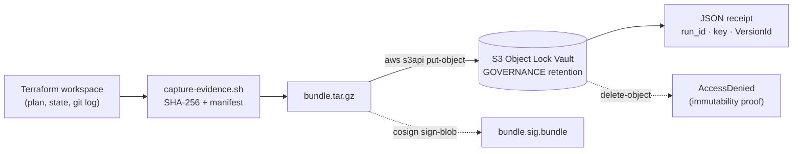

# IaC as Compliance Evidence

**An S3 Object Lock evidence vault and capture pipeline that turns Terraform runs into tamper-evident, cryptographically signed audit evidence.**


> A screenshot of a cloud console proves *"I once saw this."* A hashed, signed, immutably-stored Terraform capture proves **what** was deployed, **who** reviewed it, **when**, and that the artifact is **unchanged since**. This project builds the vault that holds that evidence and the pipeline that puts it there.

---

## The problem it solves

Compliance auditors want three properties from any piece of evidence:

| Property | Screenshot | Code-as-evidence (this project) |
| --- | :---: | :---: |
| **Integrity** — provably unaltered | ❌ | ✅ SHA-256 per file + WORM storage |
| **Attribution** — who authored/approved | ❌ | ✅ Git commit + Cosign signature |
| **Reproducibility** — rebuildable from source | ❌ | ✅ Terraform plan/state captured |

This repository implements that idea end to end: infrastructure defined as code is captured, hashed, bundled, and written to an **S3 bucket that refuses deletion by design** — so the evidence resists silent tampering, even by a privileged administrator.

## Skills & technologies demonstrated

| Area | Specifics |
| --- | --- |
| **Infrastructure as Code** | Terraform ≥ 1.6 — pinned providers, input validation, `locals`, `data` sources, explicit `depends_on`, provider `default_tags`, module-style layout under `primitives/` |
| **AWS security engineering** | S3 **Object Lock (WORM)**, versioning, SSE-AES256, public-access block, and a bucket policy that **denies `s3:DeleteBucket`** to every principal except the account root via `aws:PrincipalArn` conditions |
| **Compliance / chain of custody** | GOVERNANCE vs COMPLIANCE retention modes, default-retention applied at upload, immutability verified by a delete that must fail |
| **Secure shell tooling** | Defensive Bash (`set -euo pipefail`, `trap` cleanup, portable `sha256sum`/`shasum` fallback), machine-readable `manifest.json` + single-line JSON receipt for pipeline consumption |
| **Supply-chain security** | Sigstore **Cosign** keyless signing (OIDC), signature stored alongside the evidence bundle |
| **Repo hygiene** | State, secrets, and provider binaries kept out of version control; lock files and evidence signatures deliberately tracked |

## Architecture



The capture script reads a Terraform workspace, hashes every file, tars them, and writes the bundle to a vault that will not allow deletion of objects within their retention window. It prints a one-line JSON **receipt** whose `VersionId` is the durable handle to that exact, immutable object.

## Repository layout

```
.
├── terraform/
│   └── primitives/
│       └── evidence-vault/          # The Object Lock vault (Terraform)
│           ├── main.tf              #   bucket, versioning, object-lock, SSE,
│           │                        #   public-access block, deletion-deny policy
│           ├── variables.tf         #   project name, lock mode, retention days
│           └── outputs.tf           #   vault_name (feeds the capture script)
├── scripts/
│   ├── capture-evidence.sh          # capture → hash → bundle → upload → receipt
│   └── verify-evidence.sh           # fetch by VersionId → re-hash → verdict
├── tests/
│   └── test-verify-evidence.sh      # proves the verifier rejects tampering
├── evidence/
│   └── lab-2-5/
│       ├── receipt.json             # real run receipt (S3 VersionId recorded)
│       ├── receipt.example.json     # schema reference
│       └── bundle.sig.bundle        # Cosign signature over the evidence bundle
├── RUNBOOK.md                       # full step-by-step live AWS run
└── .gitignore                       # keeps tfstate / secrets / providers out of git
```

## How it works

**The vault** (`terraform/primitives/evidence-vault/`) provisions an S3 bucket with Object Lock enabled *at creation* (it cannot be retrofitted), versioning on (Object Lock requires it), a default GOVERNANCE retention rule, server-side encryption, a full public-access block, and a bucket policy that denies deletion of the bucket itself to anyone but the account root. Retention mode is a validated variable — `GOVERNANCE` for lab/testing, `COMPLIANCE` for evidence that must outlive any single operator.

**The capture pipeline** (`scripts/capture-evidence.sh`) collects `plan.json`, `state.json`, `commit.txt`, and `version.txt` from a target workspace, computes a SHA-256 for each, records them in a `manifest.json`, tars the set, and uploads it with `aws s3api put-object`. It emits a receipt built for automation:

```json
{
  "run_id": "test-001",
  "vault": "cgep-lab-grc-evidence-vault-XXXXXXXX",
  "key": "runs/test-001/bundle.tar.gz",
  "version_id": "<s3-object-version-id>",
  "captured_at_utc": "<iso-8601-utc>"
}
```

The real receipt from a live run is committed at [`evidence/lab-2-5/receipt.json`](evidence/lab-2-5/receipt.json).

**The immutability proof** is the point of the whole exercise: attempting to delete the uploaded object returns `AccessDenied — Access Denied because object protected by object lock`. That rejection *is* the evidence guarantee.

**Signing** uses Cosign keyless signing (Sigstore/Fulcio via OIDC) to produce `bundle.sig.bundle`, stored next to the evidence so its authorship can be verified independently.

## Reproduce it

**Prerequisites:** Terraform ≥ 1.6, AWS CLI v2 with a working profile, `git`, `tar`, and `sha256sum` (or `shasum`). Cosign is optional for the signing step.

```bash
# 1. Deploy the vault
cd terraform/primitives/evidence-vault
eval "$(aws configure export-credentials --profile <your-aws-profile> --format env)"
terraform init && terraform apply -auto-approve
VAULT=$(terraform output -raw vault_name)

# 2. Capture a Terraform workspace into the vault
cd ../../..
bash scripts/capture-evidence.sh \
  --workspace <path-to-terraform-workspace> \
  --run-id test-001 --vault "$VAULT" \
  --profile <your-aws-profile> | tee evidence/lab-2-5/receipt.json

# 3. Prove immutability — this delete is SUPPOSED to fail
VERSION_ID=$(python3 -c "import json;print(json.load(open('evidence/lab-2-5/receipt.json'))['version_id'])")
aws s3api delete-object --bucket "$VAULT" --key runs/test-001/bundle.tar.gz \
  --version-id "$VERSION_ID" --profile <your-aws-profile>   # -> AccessDenied
```

Full walkthrough, verification checks, the optional Cosign step, and cleanup are in **[RUNBOOK.md](RUNBOOK.md)**.

## Verifying evidence

Capture proves an artifact went into the vault. **Verification proves what comes
back out is the same bytes** — the other half of chain of custody, and the half
an auditor actually exercises.

```bash
bash scripts/verify-evidence.sh \
  --receipt evidence/lab-2-5/receipt.json \
  --profile <your-aws-profile>
```

The verifier fetches the object *by `VersionId`* (never the mutable key), then
runs an independent check per property and derives a verdict from the results —
a check that never runs can never be silently counted as a pass:

| Check | What it proves |
| --- | --- |
| `object_downloaded` | The pinned immutable version still exists in the vault |
| `object_lock_retention` | WORM retention is **still in force** — a lapsed vault protects nothing |
| `file:<name>` | Every manifest entry matches by SHA-256 **and** size |
| `unlisted:<name>` | Nothing was *added* to the bundle — injection is tampering too |
| `completeness:plan.json` / `state.json` | Warns when a capture ran without them, rather than passing a hollow bundle |
| `signature` | Cosign bundle verifies against an expected identity and issuer |

Output is a machine-readable verdict (`--json`) plus a non-zero exit code on
failure, so it drops straight into a pipeline gate:

```json
{ "verdict": "VERIFIED", "run_id": "test-001",
  "summary": { "passed": 11, "failed": 0, "warnings": 0 }, "checks": [ ... ] }
```

Signature verification is opt-in and deliberately refuses to run half-configured
— `--signature` without `--identity` and `--issuer` is a usage error, because a
signature verified against nobody in particular proves nothing:

```bash
bash scripts/verify-evidence.sh --receipt evidence/lab-2-5/receipt.json \
  --signature evidence/lab-2-5/bundle.sig.bundle \
  --identity '.*JayYoungCareers@users\.noreply\.github\.com' \
  --issuer https://github.com/login/oauth
```

To verify a bundle you already hold, use `--bundle <path>` — the manifest checks
run offline (the retention check is skipped, since there is no object to ask about).

### Testing the verifier

A verifier that has only ever seen valid input is an assumption, not a control.
`tests/test-verify-evidence.sh` builds fixtures and asserts that an intact bundle
verifies while altered, truncated, injected, and manifest-less bundles are all
refused. It runs in CI on every push:

```bash
bash tests/test-verify-evidence.sh
```

## Design decisions worth noting

- **Object Lock is set at bucket creation, never retrofitted** — the code reflects the AWS constraint rather than hiding it, and the troubleshooting notes document why there is no upgrade path.
- **GOVERNANCE by default, COMPLIANCE by choice** — labs need a bypass to clean up; real evidence must not be deletable by anyone, including root, until retention expires. The pattern is identical either way; only the variable changes.
- **State never enters version control** — `terraform.tfstate` and downloaded provider binaries are git-ignored; the durable copy of evidence lives in the immutable vault, not the repo.
- **The verifier derives its verdict from recorded checks, not from a running flag** — each check appends a structured result, so an aborted or skipped step surfaces as a missing pass instead of an accidental success.
- **Everything downstream keys off the `VersionId`** — an evidence reference is `s3://<vault>/<key>?versionId=...`, which pins to one immutable object rather than a mutable path.

## Context

Built as part of the **GRC Engineering Club** Compliance-as-Code curriculum (CGEP). This vault and capture pattern are the evidence backbone for the program's capstone — pull requests run through a signing pipeline that uploads here, and an OSCAL component's evidence links resolve to objects in this vault. See the capstone starter: [`GRCEngClub/cgep-app-starter`](https://github.com/GRCEngClub/cgep-app-starter).
